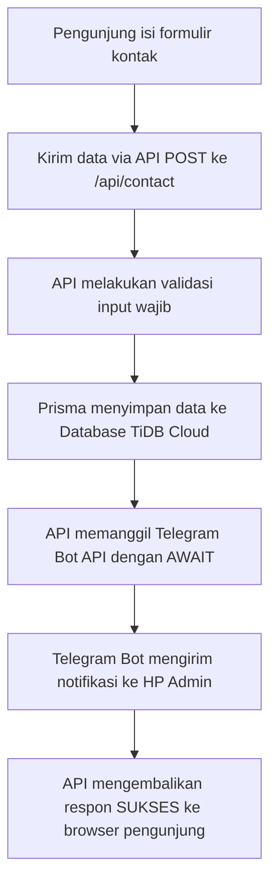

# Panduan Presentasi Website: PT IDETO KONSULTAN INDONESIA

Dokumen ini disusun untuk membantu Anda menjelaskan arsitektur, teknologi, dan alur kerja website **PT IDETO KONSULTAN INDONESIA** saat presentasi esok hari.

---

## 1. Spesifikasi Teknologi (Tech Stack)

### **A. Bahasa Pemrograman & Library**
* **TypeScript & JavaScript (ES6+)**: Bahasa utama yang digunakan. TypeScript memberikan *type-safety* (keamanan tipe data), sehingga mengurangi potensi error logika saat pengembangan.
* **React 18**: Library frontend untuk membangun antarmuka pengguna (UI) yang dinamis berbasis komponen (*component-based*).

### **B. Framework Utama**
* **Next.js 14 (App Router)**: Framework React tingkat industri (*production-grade*).
  * **Alasan Penggunaan**: Next.js mendukung *Server-Side Rendering* (SSR) yang membuat website sangat cepat dimuat dan ramah SEO (Search Engine Optimization), serta memiliki fitur *API Routes* sehingga kita tidak memerlukan server backend terpisah (Full Stack).

### **C. Database & ORM**
* **TiDB Cloud (Serverless MySQL)**: Database SQL relasional berbasis cloud.
  * **Alasan Penggunaan**: TiDB memiliki arsitektur terdistribusi yang aman, mendukung performa tinggi, gratis, dan mendukung penskalaan otomatis (*auto-scaling*).
* **Prisma ORM**: Penghubung antara kode aplikasi Next.js dengan database TiDB.
  * **Alasan Penggunaan**: Mempermudah pengelolaan database (pembuatan tabel/migrasi) melalui kode tanpa perlu menulis perintah SQL manual.

### **D. Layanan Hosting & Integrasi**
* **Vercel**: Platform cloud untuk mendeploy (hosting) aplikasi Next.js. Menjamin website aktif 24 jam dengan kecepatan akses tinggi dari seluruh dunia.
* **Telegram Bot API**: Digunakan untuk mengirimkan notifikasi instan secara *real-time* kepada admin ketika ada pesan masuk.

---

## 2. Fitur & Keunggulan Utama (Wow Factors)

1. **Dashboard Admin Mandiri**: Admin dapat mengelola pesan masuk, mengganti kata sandi admin secara mandiri, dan melihat data statistik performa website.
2. **Notifikasi Instan Telegram**: Admin tidak perlu selalu membuka dashboard setiap saat. Setiap ada klien yang mengisi formulir, HP admin akan langsung berbunyi menerima pesan notifikasi detail dari Bot Telegram.
3. **Desain Premium & Responsif**: Menggunakan tren desain modern (*Glassmorphism*, palet warna hijau hutan khas Ideto, animasi *Scroll Reveal* yang halus) dan sepenuhnya responsif diakses dari HP (Mobile), Tablet, maupun Laptop.
4. **Keamanan Data**: Autentikasi Admin dilindungi dengan enkripsi token (JSON Web Token/localStorage) dan koneksi database TiDB dilindungi dengan enkripsi **SSL/TLS**.

---

## 3. Alur Kerja & Algoritma Sistem

### **A. Alur Pengiriman Pesan & Notifikasi (Formulir Kontak)**
Berikut adalah algoritma langkah demi langkah saat pengunjung mengirim pesan di website:

* **Catatan Penting**: Penggunaan kata kunci `await` pada pengiriman Telegram memastikan Vercel tidak mematikan server serverless sebelum pesan benar-benar sampai ke Telegram.

### **B. Alur Keamanan Login Admin**
1. Pengguna memasukkan username dan password di halaman `/admin/login`.
2. Data dikirim ke API `/api/admin/login` untuk dicocokkan dengan data tabel `Admin` di TiDB.
3. Jika cocok, server mengembalikan token akses unik.
4. Token disimpan aman di browser admin (`localStorage`).
5. Middleware / Layout Guard (`AdminLayoutWrapper`) akan selalu mengecek token ini setiap kali halaman admin dibuka. Jika tidak ada token, pengguna otomatis ditendang keluar ke halaman login.

---

## 4. Struktur Database (Skema Relasional)

Database kita menggunakan skema relasional yang ramping dan cepat:
1. **`Layanan` & `LayananItem`**: Menyimpan daftar kategori jasa konsultasi (AMDAL, Limbah B3, dll.) serta poin-poin detail di dalamnya.
2. **`Program` & `ProgramItem`**: Menyimpan data pendidikan dan pelatihan yang disediakan oleh PT Ideto.
3. **`Portfolio`**: Menyimpan rekam jejak proyek sukses perusahaan beserta foto galeri.
4. **`Kontak`**: Menyimpan data pesan masuk dari klien (nama, email, telepon, subjek, pesan, dan status tindak lanjut).
5. **`Admin`**: Menyimpan kredensial username dan password terenkripsi untuk panel admin.

---

*Selamat mempresentasikan hasil website luar biasa ini besok! Semoga sukses!*
